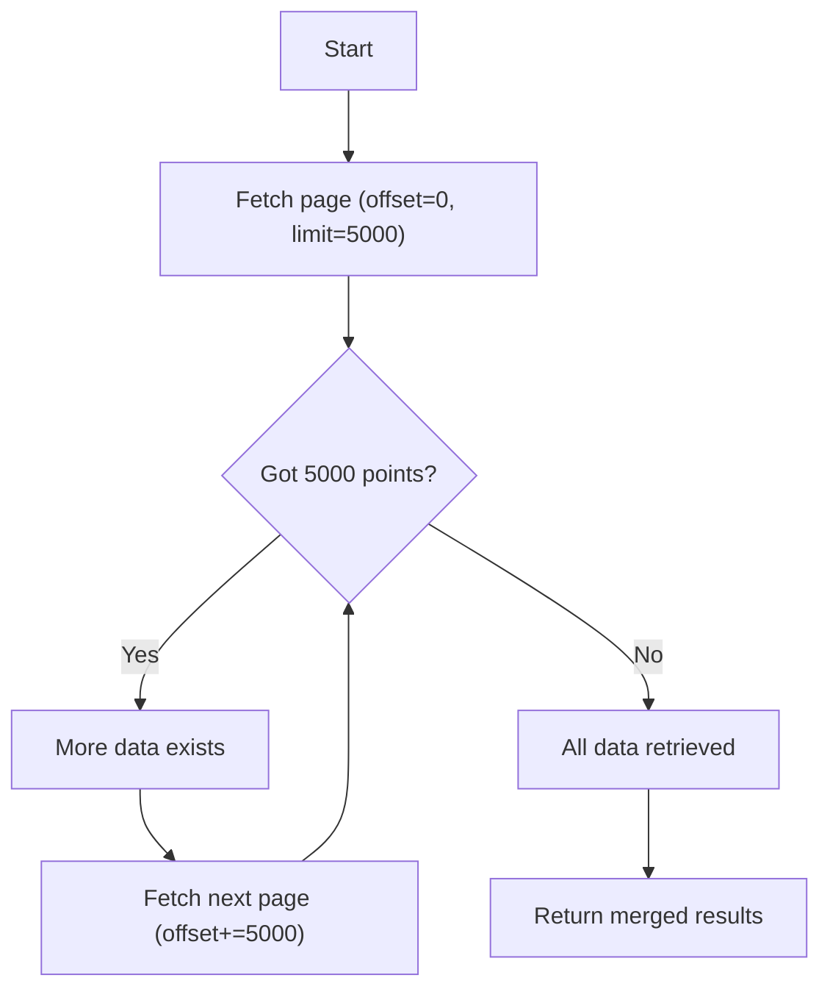
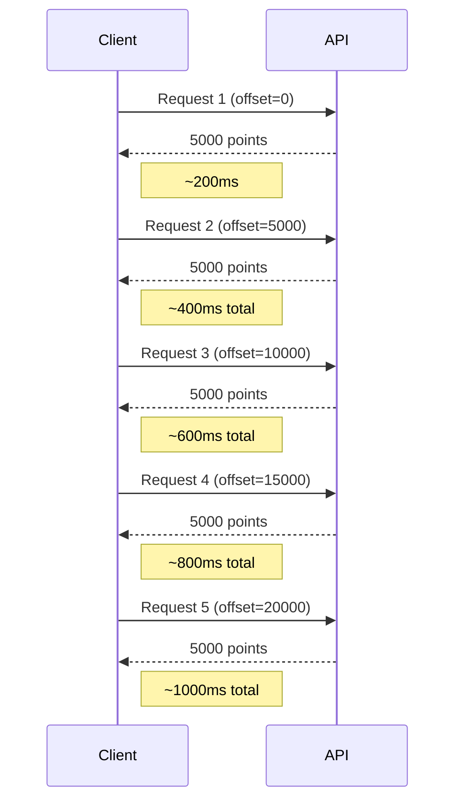
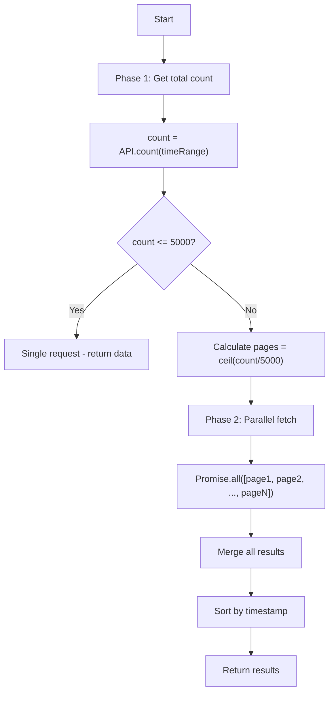
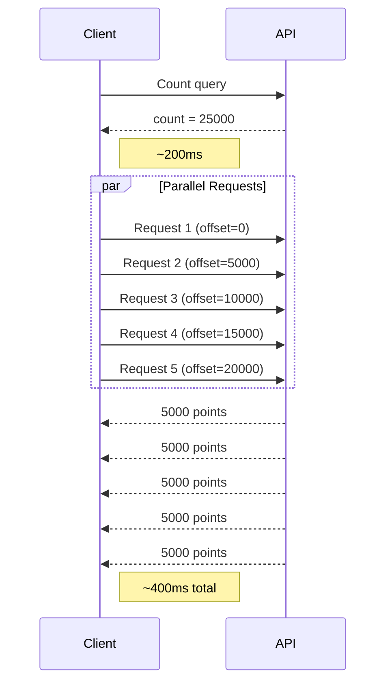
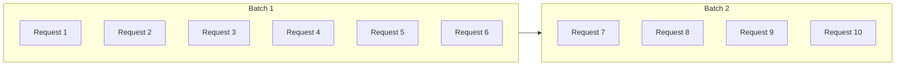

# Data Fetching Architecture

This document explains the two data fetching strategies implemented in `data.service.ts` for retrieving raw metrics from the IXON API.

## Overview

The IXON DataList API has a **5,000 point limit** per request. When retrieving large datasets, we must paginate through the data using offset-based pagination. Two strategies are implemented:

| Strategy | Method | Best For |
|----------|--------|----------|
| Sequential Pagination | `_getAllRawMetrics` | Small datasets, fallback |
| Count-Prefetch Pagination | `_getAllRawMetricsParallel` | Large datasets (default) |

---

## Sequential Pagination (Old)

### How it works

Fetches data page by page, checking after each request if more data exists.



### Characteristics

- **Pros**: Simple, reliable, no wasted requests
- **Cons**: Slow for large datasets (requests are sequential)
- **Time complexity**: `O(n)` where n = number of pages

### Example: 25,000 data points



**Total time: ~1000ms** (5 sequential requests)

---

## Count-Prefetch Pagination (New)

### How it works

First queries the total count, then fires all page requests in parallel.



### Key Implementation Details

1. **Count Query**: Uses `postAggr: 'count'` with a `step` spanning the entire time range to get accurate total count
2. **Parallel Requests**: All page requests use `order: 'asc'` to ensure consistent ordering
3. **Merge & Sort**: Results are merged and sorted by timestamp

### Example: 25,000 data points



**Total time: ~400ms** (1 count + parallel requests)

---

## Performance Comparison

```mermaid
xychart-beta
    title "Request Time vs Data Points"
    x-axis "Data Points (thousands)" [5, 10, 25, 50, 100]
    y-axis "Time (ms)" 0 --> 4500
    bar "Sequential" [200, 400, 1000, 2000, 4000]
    bar "Parallel" [400, 400, 400, 400, 600]
```



| Data Points | Pages | Sequential | Parallel | Speedup |
|-------------|-------|------------|----------|---------|
| 5,000 | 1 | 200ms | 400ms | 0.5x |
| 10,000 | 2 | 400ms | 400ms | 1x |
| 25,000 | 5 | 1,000ms | 400ms | **2.5x** |
| 50,000 | 10 | 2,000ms | 400ms | **5x** |
| 100,000 | 20 | 4,000ms | 600ms | **6.7x** |

### Speedup Formula

```
Sequential: T = n × request_time
Parallel:   T = 2 × request_time (count + parallel batch)

Speedup = n / 2  (for n > 2 pages)
```

---

## API Configuration

### Count Query

```typescript
{
  start: "2024-01-01T00:00:00Z",
  end: "2024-01-31T23:59:59Z",
  timeZone: "UTC",
  source: { publicId: "..." },
  tags: [{
    slug: "temperature",
    preAggr: "raw",
    queries: [{
      ref: "temperature",
      postAggr: "count",
      step: 2678400  // Time range in seconds (single bucket)
    }]
  }]
}
```

### Page Fetch Query

```typescript
{
  start: "2024-01-01T00:00:00Z",
  end: "2024-01-31T23:59:59Z",
  timeZone: "UTC",
  source: { publicId: "..." },
  tags: [{
    slug: "temperature",
    preAggr: "raw",
    queries: [{
      ref: "temperature",
      limit: 5000,
      offset: 0,      // 0, 5000, 10000, ...
      order: "asc"    // Critical for parallel consistency
    }]
  }]
}
```

---

## When to Use Each Strategy

| Scenario | Recommended Strategy |
|----------|---------------------|
| Default | Count-Prefetch (Parallel) |
| Small datasets (<10k points) | Either (similar performance) |
| Large datasets (>10k points) | Count-Prefetch (Parallel) |
| Debugging/troubleshooting | Sequential (simpler flow) |
| API rate limiting concerns | Sequential (spreads requests) |

---

## Browser Considerations

Browsers limit concurrent connections per domain (typically 6). For very large datasets requiring many pages, requests will be batched:



This is handled automatically by the browser and still provides significant speedup over sequential requests.
